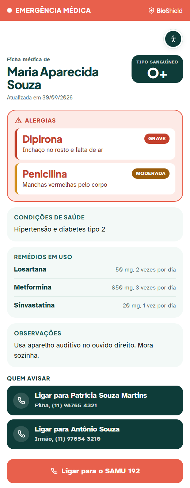
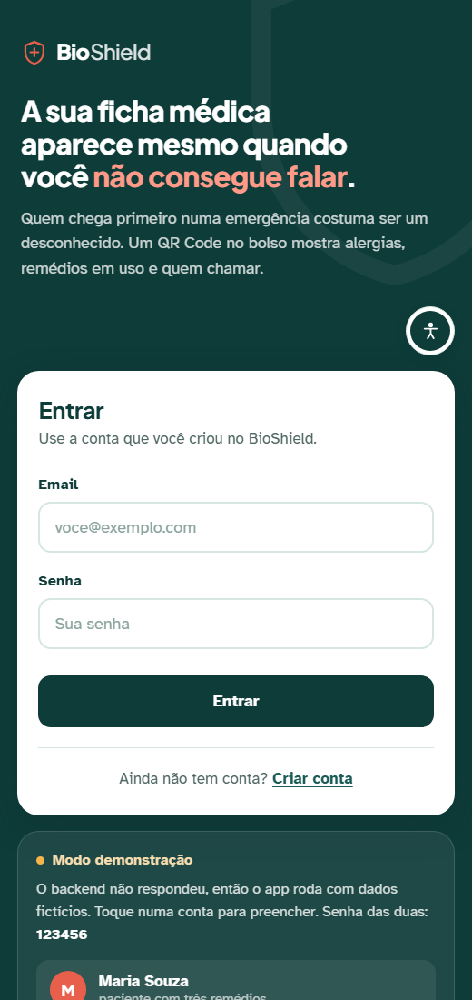

# BioShield

Ficha médica de emergência em QR Code e alarme de remédios para quem não pode contar com a própria memória ou com a própria voz.


<p align="center">
  
  &nbsp;&nbsp;&nbsp;
  
</p>

<p align="center">
  À esquerda, a ficha que um desconhecido vê ao escanear o QR Code. À direita, a tela de entrada. As duas imagens usam dados fictícios.
</p>

---

## O problema

Quando alguém desmaia, tem uma crise ou se perde na rua, quem chega primeiro quase nunca é o socorrista. É um desconhecido, que não tem como saber se a pessoa é alérgica a dipirona, se tem epilepsia ou para quem ligar.

Existem pulseiras de identificação para isso, e Manaus chegou a criar uma lei municipal para distribuir pulseiras com QR Code a idosos e pessoas com deficiência. O problema é que elas são gravadas uma vez só: mudou o remédio, tem que trocar a pulseira.

O BioShield resolve isso por software. A própria pessoa gera o QR Code, atualiza a ficha quando quiser e imprime onde preferir: cartão na carteira, adesivo, chaveiro ou pulseira. O código continua o mesmo; o que muda é a ficha por trás dele.

## O que o app faz

**Ficha de emergência pelo QR Code.** Quem escaneia vê, em poucos segundos, as alergias a medicamento (as graves em vermelho, primeiro), os remédios em uso, o tipo sanguíneo, as condições de saúde e os contatos de emergência com botão de ligar. Abre direto no navegador, sem login e sem instalar nada, em qualquer celular com internet. Se a pessoa perder o chaveiro, cancela o código pelo app, e quem escanear o papel perdido vê só um aviso de código cancelado. Toda leitura fica registrada, e o dono da ficha vê quando e de que tipo de aparelho ela foi aberta.

**Remédios e alarme.** A pessoa cadastra o remédio com dose, intervalo e horário da primeira tomada, e o BioShield monta a agenda sozinho. Na hora de cada dose o celular toca um alarme, com som próprio e vibração, e repete a cada 5 minutos até a pessoa tocar em **Tomei**, inclusive com a tela bloqueada e o app fechado. A tela de doses mostra a agenda do dia e a adesão de hoje e da semana. Remédio pode ser suspenso e reativado sem perder o histórico.

**Modo cuidador.** O familiar acompanha de longe a adesão da semana, as doses perdidas e a próxima dose. Quando alguém que ele acompanha passa 1 hora sem confirmar uma dose, o celular do cuidador avisa, mesmo com o app fechado. O vínculo só existe depois que o próprio paciente gera um código de autorização e entrega para o cuidador, e o cuidador não vê nem edita a ficha médica.

**Etiquetas do QR Code.** Uma folha A4 com o QR Code em quatro modelos, do cartão de carteira ao mini adesivo de pulseira. A pessoa escreve a frase de destaque que quiser (em branco, sai "EM CASO DE EMERGÊNCIA ESCANEIE ME") e, se quiser, uma informação extra, como "diabética, usa insulina". Dá para imprimir, salvar a folha em PDF no tamanho real ou baixar cada modelo como imagem, no computador e no celular.

## Para quem

Idosos, pessoas com doenças crônicas, pessoas com alergia grave a medicamento, pessoas autistas com maior necessidade de suporte e os cuidadores de todas elas.

Esse público decidiu a interface: letra grande, contraste alto, poucos passos por tela e nenhum termo médico sem explicação. Em toda tela há um botão de acessibilidade que aumenta a letra em quatro tamanhos e liga um modo de contraste reforçado.

## Tecnologias

| Parte | O que usa |
|---|---|
| Backend | Node.js, Express e TypeScript, rodando com tsx |
| Banco | MySQL 8 ou o MariaDB 10.4 do XAMPP, acessado com mysql2 e pool de conexões |
| Segurança | bcryptjs para guardar a senha e jsonwebtoken para a sessão |
| Telas | HTML, CSS e JavaScript, sem framework |
| App Android | Capacitor 8, com os plugins oficiais `@capacitor/app` e `@capacitor/local-notifications` e dois plugins nativos do projeto, em Java: os avisos do cuidador e a impressão e o salvamento de arquivos |
| Servidor na internet | Tailscale Funnel, no notebook da equipe, sem hospedagem paga |
| Testes | Jest |

Não há ORM: o SQL é escrito à mão e fica todo na camada de infraestrutura. O gerador de QR Code e o PDF das etiquetas também são do projeto, sem biblioteca externa.

## Arquitetura

O backend segue camadas inspiradas em DDD e Clean Architecture, e toda requisição faz o mesmo caminho:

```
rota  ->  controller  ->  service  ->  infrastructure  ->  banco
                            |
                            v
                  entidade + value object
```

| Pasta | Papel |
|---|---|
| `routes/` | Liga cada caminho HTTP ao seu controller |
| `middleware/` | Confere o token de sessão |
| `controllers/` | Lê a requisição, chama o service e devolve a resposta com o status certo |
| `services/` | Regras de negócio, validação e permissões |
| `repository/` | Interfaces que dizem o que o service precisa do banco |
| `infrastructure/` | O SQL que implementa essas interfaces |
| `models/entidade/` | Objetos de domínio, como Paciente, Medicamento e Dose |
| `models/valueObjects/` | Valores que se validam sozinhos, como Email, Telefone e TipoSanguineo |
| `models/dto/` | O formato exato do que entra e do que sai da API |

As dependências apontam sempre para dentro: o service conhece só a interface do repositório, nunca o SQL. O detalhe de cada classe está em [`docs/DICIONARIO_DETALHADO.md`](docs/DICIONARIO_DETALHADO.md).

```
bioshield/
├── backend/        API (server.ts, camadas acima e tests/)
├── frontEnd/       telas do site e do app
├── android/        projeto Android gerado pelo Capacitor, com os plugins nativos do projeto
├── database/       script do banco, dados fictícios e dicionário de dados
└── docs/           guias, decisões, roadmap e imagens
```

## Como rodar

Você vai precisar do Node.js 20 ou mais novo (22 para gerar o app Android) e do MySQL 8.0.16 ou mais novo, ou do MariaDB que vem no XAMPP. Os passos abaixo são para Windows. Para deixar o BioShield aberto na internet com o Tailscale Funnel, que é o plano do evento, siga depois o [`docs/SERVIDOR_ONLINE.md`](docs/SERVIDOR_ONLINE.md).

**1. Baixar o projeto e as dependências**

```bash
git clone https://github.com/Erikfrvr/bioshield.git
cd bioshield/backend
npm install
```

**2. Criar o banco.** Com o MySQL ligado, rode os dois scripts, nesta ordem. O primeiro cria o banco e as tabelas; o segundo coloca as pessoas fictícias usadas nos testes e na apresentação.

```bash
mysql -u root -p --default-character-set=utf8mb4 < ../database/bioshield.sql
mysql -u root -p --default-character-set=utf8mb4 < ../database/dados_ficticios.sql
```

No XAMPP o `root` não tem senha, então é só apertar Enter quando ela for pedida. Também dá para importar os dois arquivos pelo phpMyAdmin ou pelo MySQL Workbench. O `bioshield.sql` só funciona num banco que ainda não existe. O `dados_ficticios.sql` pode ser rodado quantas vezes quiser: ele apaga e recria só as oito contas fictícias, pela lista exata dos emails delas, com as doses montadas em volta da hora em que rodou. Contas criadas pelo app ficam como estão, e os QR Codes das contas fictícias têm código fixo no script, então rodar de novo não estraga papel já impresso. Vale rodar de novo no dia da apresentação, para o histórico ficar com cara de hoje.

**3. Configurar o ambiente**

```bash
cp .env.example .env
```

| Variável | Para que serve | Exemplo |
|---|---|---|
| `DB_HOST` | Endereço do MySQL | `127.0.0.1` |
| `DB_USER` | Usuário do MySQL | `root` |
| `DB_PASSWORD` | Senha do MySQL | vazio no XAMPP |
| `DB_NAME` | Nome do banco | `bioshield` |
| `DB_PORT` | Porta do MySQL | `3306` |
| `PORT` | Porta do BioShield, a mesma para site, app e API | `3000` |
| `JWT_SECRET` | Segredo que assina o login. Use um texto longo e só seu, de 32 letras ou mais | |
| `URL_PUBLICA` | Endereço público do servidor, que vai dentro do QR Code. Com o Tailscale Funnel, é o endereço `.ts.net`. Vazio, o servidor usa o IP da rede e o QR só abre no mesmo wifi | `https://bioshield.bonito-tench.ts.net` |

O `.env` de verdade nunca vai para o Git.

**4. Ligar o servidor**

```bash
npm run dev
```

O mesmo servidor entrega a API e as telas. O terminal mostra o endereço deste computador, o endereço para os celulares da mesma rede e o endereço que vai dentro do QR Code:

```
Servidor rodando em http://localhost:3000
Nos celulares e nos outros computadores da mesma rede, use:
  http://192.168.0.10:3000
Endereco que vai dentro do QR Code: http://192.168.0.10:3000
  Esse endereco so abre para quem estiver no mesmo wifi. Para abrir pelo 4G com o Tailscale Funnel,
  coloque o endereco dele no URL_PUBLICA do .env (veja docs/SERVIDOR_ONLINE.md).
Conexao com o banco MySQL estabelecida com sucesso.
```

O `npm run dev` reinicia sozinho quando um arquivo muda; para deixar só ligado, use `npm start`. Depois é abrir `http://localhost:3000` no navegador.

Para testar as rotas sem as telas, o arquivo `backend/requests.http` tem uma requisição pronta para cada caso, com o status esperado no comentário. Ele roda com a extensão REST Client do VS Code.

### Contas de teste

Todas as contas de demonstração usam o primeiro nome da pessoa com `@bioshield.com` e a mesma senha padrão: `@Senac_empreenda2026`. As fictícias são criadas pelo `dados_ficticios.sql`, que já grava essa senha. As do Erik e da Daiane foram criadas pelo app, no servidor do evento.

| Conta | O que dá para mostrar |
|---|---|
| `erik@bioshield.com` | A conta do Erik, integrante da equipe. É nela que ele monta a ficha que vai para a mesa |
| `daiane@bioshield.com` | A conta da Daiane, integrante da equipe. É nela que ela monta a ficha que vai para a mesa |
| `maria@bioshield.com` | A paciente principal: ficha completa, uma semana de doses em dia e leituras do QR no histórico. Tem um remédio em uso, um suspenso e um encerrado |
| `patricia@bioshield.com` | Cuidadora da Maria, que está em dia, e do Lucas, que tem doses perdidas. Não tem ficha própria |
| `joana@bioshield.com` | Duas alergias graves em destaque na ficha de emergência. Ninguém acompanha a Joana, então dá para criar o vínculo com a Patrícia na hora |
| `lucas@bioshield.com` | Tratamento com data para acabar e adesão baixa |
| `roberto@bioshield.com` | QR Code cancelado: escanear o código dele mostra o aviso de código cancelado |
| `davi@bioshield.com` | Davi, autista com nível 3 de suporte, que não fala e pode se perder. A ficha diz como se aproximar dele e quem chamar. É a conta que a mãe dele usaria |
| `diego@bioshield.com` | Diego, motoboy: sangue O negativo, alergia grave a diclofenaco e o aviso de não tirar o capacete depois de um acidente. Não toma remédio nenhum |
| `renata@bioshield.com` | Renata, ciclista com diabetes tipo 1: a ficha explica o que fazer se a glicose estiver baixa |

A senha padrão segue a mesma regra que o cadastro exige de qualquer conta nova: pelo menos 8 caracteres, com letra maiúscula, letra minúscula, número e um destes símbolos: `@ $ ! % * ? & #`. Como o `dados_ficticios.sql` já grava essa senha, rodar o script de novo mantém a senha padrão. O modo demonstração, que roda no navegador sem servidor, usa a mesma senha.

### QR Codes da apresentação

No dia do Empreenda, estes são os QR Codes que vamos mostrar. Cada um conta uma situação diferente em que um desconhecido chega primeiro:

| Ficha | A situação | O que o visitante vê ao escanear |
|---|---|---|
| Maria Souza | Idosa que mora sozinha, com hipertensão e diabetes | Duas alergias, três remédios em uso, o tipo sanguíneo e a filha como primeiro contato |
| Davi Oliveira Santos | Autista que se perdeu e não consegue dizer quem é | Que ele não fala, como se aproximar sem assustar, a alergia grave a amendoim e o telefone da mãe e do pai |
| Renata Alves Moreira | Ciclista que passou mal na rua | Diabetes tipo 1, o que fazer na glicose baixa, a insulina que ela usa e o marido como contato |
| Erik | Integrante da equipe | A ficha que o próprio Erik montou no app |
| Daiane | Integrante da equipe | A ficha que a própria Daiane montou no app |

O Diego, o motoboy, fica de reserva: é a melhor ficha para falar de acidente de trânsito.

Para abrir uma ficha fictícia sem escanear, com o servidor ligado, é só usar o mesmo endereço que vai dentro do QR:

| Ficha | Endereço |
|---|---|
| Maria Souza | `https://bioshield.bonito-tench.ts.net/pages/emergencia.html?token=a3f81c2d94be47a0b6e15d7c0f29b834` |
| Davi Oliveira Santos | `https://bioshield.bonito-tench.ts.net/pages/emergencia.html?token=07b94e9b13b9185cca241a9cfe021248` |
| Renata Alves Moreira | `https://bioshield.bonito-tench.ts.net/pages/emergencia.html?token=0ff92863f327ecc1757776b6eb9077ee` |
| Diego Ferreira Rocha | `https://bioshield.bonito-tench.ts.net/pages/emergencia.html?token=b52baf6fff61bf1bf7074d6a13120748` |

Cada abertura fica registrada no histórico de acessos da ficha, como uma leitura de verdade.

As contas do Erik e da Daiane (`erik@bioshield.com` e `daiane@bioshield.com`) foram criadas pelo app, no servidor do evento, e cada um preenche a própria ficha com o que quiser mostrar. Elas não ficam no `dados_ficticios.sql` nem no repositório, porque são de pessoas reais, e rodar o script não apaga as duas: ele só mexe nas oito contas fictícias, pela lista exata dos emails delas, mesmo que todas terminem em `@bioshield.com`.

## Servidor na internet

No Empreenda, o BioShield roda no notebook do Erik, e o Tailscale Funnel dá a ele um endereço público com HTTPS:

```
https://bioshield.bonito-tench.ts.net
```

É esse endereço que vai dentro dos QR Codes da mesa. O visitante escaneia pelo 4G ou por qualquer wifi, sem instalar nada, e o endereço não muda quando o notebook troca de rede. Ele está no ar desde 06/10/2026, mas só responde enquanto o notebook estiver ligado com o backend rodando. A montagem, passo a passo, está no [`docs/SERVIDOR_ONLINE.md`](docs/SERVIDOR_ONLINE.md).

## Testes

```bash
cd backend
npm test
```

São 45 testes com Jest, em 8 arquivos, cobrindo os value objects (Email, Senha, Telefone, TipoSanguineo e TokenQR) e as entidades Alergia, Cuidador e FichaEmergencia. Eles não usam o banco.

Além deles, conferimos o projeto de ponta a ponta: todas as rotas da API contra um banco de teste, todas as telas num navegador do tamanho de um celular (como site e simulando o app), o QR Code das telas e dos PDFs lido por um leitor independente, o APK rodando num celular virtual (com o alarme disparando com o app fechado e o PDF das etiquetas salvo na pasta Download) e o app instalado num celular de verdade, conectando no servidor pelo 4G.

## App Android

O mesmo conjunto de telas vira app Android com o Capacitor. O projeto nativo fica na pasta `android/`, e o passo a passo para gerar o APK, pelo Android Studio ou pela linha de comando, está em [`docs/GUIA_APK.md`](docs/GUIA_APK.md).

```bash
npm install
npm run app:sync
npm run app:abrir
```

O app não carrega o servidor dentro dele. Na primeira vez que abre, o quadro Servidor da tela de entrada já vem com o endereço do evento escrito, e basta tocar em **Testar e salvar**. Com o endereço `.ts.net` do Tailscale Funnel, o celular funciona em qualquer internet; com o IP da rede local, precisa estar no mesmo wifi do servidor.

O que só existe no app: o alarme dos remédios tocando pelo próprio Android, mesmo com o app fechado; o aviso de dose perdida no celular do cuidador; e a impressão e o salvamento das etiquetas, que abrem a janela de impressão do Android e gravam o PDF e as imagens na pasta Download/BioShield. O botão Voltar do Android volta de tela em tela e fecha o app na primeira.

## Modo demonstração

As telas também funcionam sozinhas, sem servidor e sem banco. Nesse caso usam quatro dos personagens do `dados_ficticios.sql` (Maria, Joana, Lucas e Patrícia), guardados só naquela aba do navegador, e avisam isso na tela. Serve para apresentar, gravar vídeo ou mexer nas telas com a API desligada. O alarme dos remédios funciona igual na demonstração.

Quem decide é o campo `MODO` do `frontEnd/js/config.js`:

| `MODO` | Comportamento |
|---|---|
| `auto` | O padrão. Procura o servidor e, se nenhum responder, entra na demonstração |
| `api` | Sempre o servidor. Se ele cair, aparece o erro na tela |
| `demo` | Sempre a demonstração, mesmo com o servidor no ar |

A demonstração tem duas travas para não enganar ninguém. Quem está logado numa conta de verdade nunca cai nos dados fictícios: se o servidor sumir, aparece o aviso de que não deu para falar com ele. E quem escaneia um QR Code nunca vê paciente inventado: sem servidor, a página orienta a ligar para o SAMU.

## API

Com exceção das rotas públicas, todas pedem o cabeçalho `Authorization: Bearer <token>`, com o token que o login devolve.

| Método | Rota | O que faz |
|---|---|---|
| `GET` | `/api/status` | Pública. Diz que a API está no ar, qual é o endereço público do servidor e se o banco respondeu |
| `POST` | `/api/usuarios` | Pública. Cria uma conta |
| `POST` | `/api/usuarios/login` | Pública. Confere email e senha e devolve o token |
| `GET` | `/api/usuarios/:id` | Dados da própria conta |
| `POST` | `/api/pacientes` | Cria a ficha médica e o primeiro QR Code |
| `GET` | `/api/pacientes/:id` | Lê a ficha médica |
| `PUT` | `/api/pacientes/:id` | Atualiza a ficha médica |
| `POST` | `/api/pacientes/:id/qr/rotacionar` | Troca o QR Code; o anterior para de funcionar na hora |
| `DELETE` | `/api/pacientes/:id/qr` | Cancela o QR Code (chaveiro perdido) |
| `POST` | `/api/pacientes/:id/qr/reativar` | Gera um QR novo depois de um cancelamento; o cancelado continua sem abrir |
| `GET` | `/api/pacientes/:id/acessos` | Quem abriu a ficha pelo QR |
| `POST` | `/api/pacientes/:id/codigo` | Gera o código de 7 caracteres para autorizar um cuidador, válido por 24 horas |
| `GET` | `/api/emergencia/:token` | Pública. A ficha de emergência que o QR abre |
| `GET` | `/api/medicamentos` | Remédios do paciente, com a próxima dose de cada um |
| `POST` | `/api/medicamentos` | Cadastra um remédio e monta a agenda de doses |
| `PUT` | `/api/medicamentos/:id` | Altera um remédio. Com `ativo` suspende ou reativa, e a agenda futura é refeita quando horário ou período mudam |
| `DELETE` | `/api/medicamentos/:id` | Apaga um remédio e as doses dele |
| `GET` | `/api/doses/hoje` | Doses do dia |
| `GET` | `/api/doses/proximas` | Doses previstas dos próximos 2 dias, que o app usa para agendar o alarme |
| `POST` | `/api/doses/:id/confirmar` | Confirma que a dose foi tomada |
| `GET` | `/api/doses/adesao` | Adesão de hoje e dos últimos 7 dias |
| `POST` | `/api/cuidadores/vincular` | Cria o vínculo de cuidador a partir do código do paciente |
| `GET` | `/api/cuidadores/:id/pacientes` | Quem o cuidador acompanha, com adesão, doses perdidas e próxima dose |
| `GET` | `/api/cuidadores/:id/alertas` | Doses perdidas das últimas 24 horas de quem o cuidador acompanha, para o aviso no celular |
| `DELETE` | `/api/cuidadores/vinculo/:id` | Desfaz o vínculo, guardando o registro de que ele existiu |

A agenda de doses não depende de nenhuma rotina rodando no servidor: antes de responder, as rotas de dose, de remédios e do cuidador completam os dias que faltam e marcam como perdida a dose que passou 60 minutos sem confirmação.

Corpo de cada requisição, respostas e códigos de erro estão em [`frontEnd/CONTRATO_API.md`](frontEnd/CONTRATO_API.md).

## Banco de dados

Oito tabelas, descritas campo por campo em [`database/DICIONARIO_DADOS.md`](database/DICIONARIO_DADOS.md).

```
usuarios 1 ─── 1 pacientes 1 ─── N alergias
                         1 ─── N contatos_emergencia
                         1 ─── N medicamentos 1 ─── N doses
                         1 ─── N acessos_qr
usuarios N ─── N pacientes  (via cuidador_paciente)
```

## Privacidade

Dado de saúde é dado sensível pela LGPD, e isso pesou em várias decisões:

- A ficha pública mostra só o que ajuda a socorrer. Email, senha, endereço e histórico nunca saem pela rota do QR
- A senha é guardada como hash bcrypt e não aparece em nenhuma resposta nem em log
- O token do QR é aleatório, com 128 bits, e pode ser trocado ou cancelado a qualquer momento
- Toda leitura da ficha pública fica registrada e visível para o dono, com o IP verdadeiro de quem escaneou, mesmo passando pelo Tailscale Funnel
- Cuidador só enxerga um paciente depois de autorizado por ele, e mesmo assim só o acompanhamento das doses. O aviso de dose perdida diz só quem, qual remédio e de que horário
- A informação extra das etiquetas é escrita pela própria pessoa, que é avisada de que quem pegar a etiqueta vai ler
- O servidor não registra o corpo das requisições, e o repositório só tem dados fictícios

## Documentação

| Documento | O que tem |
|---|---|
| [`docs/ROADMAP.md`](docs/ROADMAP.md) | O resumo do projeto: a linha do tempo de todas as fases, onde estamos e o que falta |
| [`docs/ROADMAP_FASES.md`](docs/ROADMAP_FASES.md) | Cada fase, tarefa por tarefa, com quem fez e quando |
| [`frontEnd/CONTRATO_API.md`](frontEnd/CONTRATO_API.md) | Todas as rotas, com exemplos de requisição e resposta |
| [`database/DICIONARIO_DADOS.md`](database/DICIONARIO_DADOS.md) | Cada tabela e cada coluna do banco |
| [`docs/DICIONARIO_DETALHADO.md`](docs/DICIONARIO_DETALHADO.md) | Cada classe do backend, cada script das telas e o código nativo do Android |
| [`docs/DUVIDAS_CONTRATO.md`](docs/DUVIDAS_CONTRATO.md) | As decisões de regra de negócio e o porquê de cada uma |
| [`docs/GUIA_APK.md`](docs/GUIA_APK.md) | Como gerar e usar o app Android, o alarme, os avisos do cuidador e as etiquetas no celular |
| [`docs/SERVIDOR_ONLINE.md`](docs/SERVIDOR_ONLINE.md) | Como colocamos o BioShield na internet com o Tailscale Funnel, no notebook do evento |
| [`docs/DIA_DO_EVENTO.md`](docs/DIA_DO_EVENTO.md) | O plano da mesa de QR Codes no Empreenda |

## Situação

Versão 1.0, de 04/10/2026, com as três funcionalidades completas e testadas no site e no app Android. Depois dela vieram o aviso de dose perdida no celular do cuidador, o servidor na internet com o Tailscale Funnel e as etiquetas no celular, com PDF e imagens.

O que ainda depende da equipe é a preparação do evento: o Erik e a Daiane preencherem as próprias fichas no app, imprimir e testar os QR Codes da mesa e gravar o vídeo da demonstração. A lista completa está no [`docs/ROADMAP.md`](docs/ROADMAP.md).

Limites conhecidos desta versão:

- O servidor do evento é um notebook. Se ele desligar ou ficar sem internet, nenhum QR abre; o plano B está no [`docs/DIA_DO_EVENTO.md`](docs/DIA_DO_EVENTO.md)
- O app trabalha no horário de Brasília. Um paciente em outro fuso recebe o alarme no horário de Brasília
- No Android 9 ou mais antigo, o app não grava direto na pasta Download: abre a janela de compartilhar para a pessoa escolher onde guardar o arquivo
- O APK é de depuração, para instalar direto no celular. Publicar na Play Store pede conta de desenvolvedor, assinatura própria e a revisão de algumas permissões

## Contexto

Projeto do Empreenda Senac 2026, categoria Cursos Técnicos, feito no Curso Técnico em Informática do Senac SP. Áreas de atuação: Saúde Preventiva e Segurança Medicamentosa. Ligado aos ODS 3 (Saúde e Bem Estar), 10 (Redução das Desigualdades) e 17 (Parcerias e Meios de Implementação).

## Equipe

- **Erik Mauricio Silva** ([@Erikfrvr](https://github.com/Erikfrvr))
- **Daiane Duarte** ([@DaiHoss](https://github.com/DaiHoss))

## Licença

MIT
